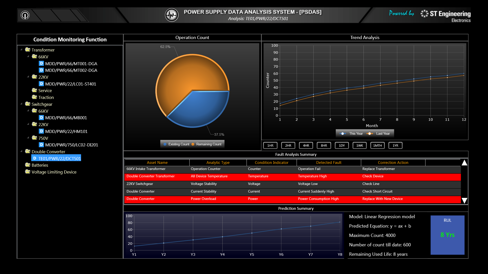
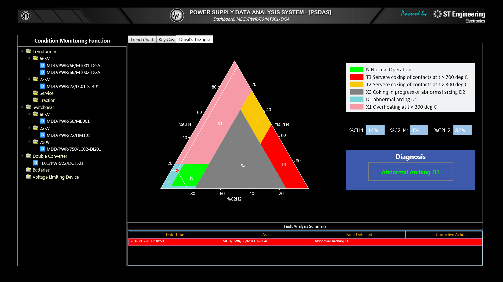
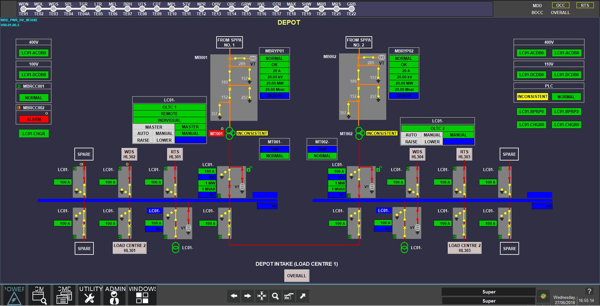
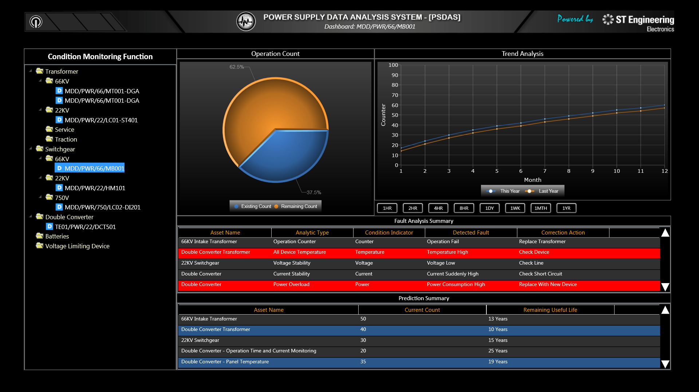
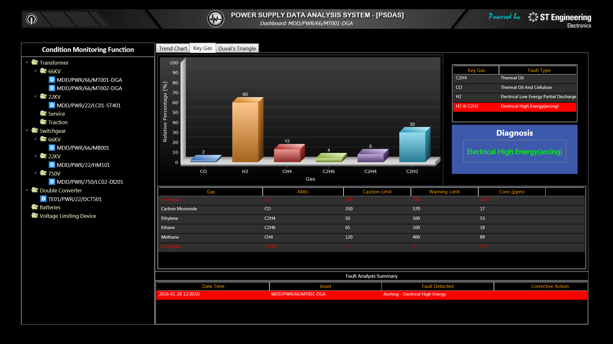
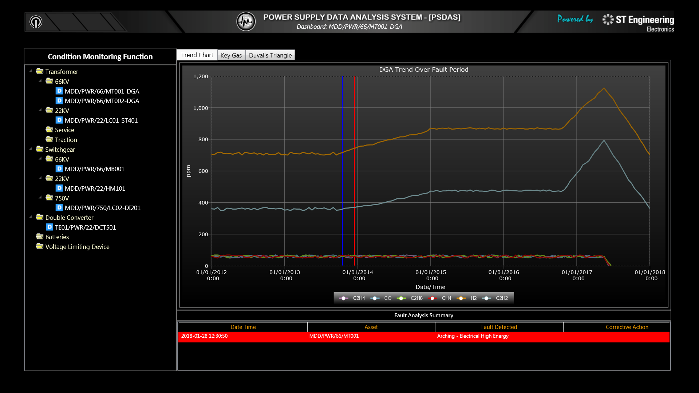

# Condition Monitoring
### Definition
Condition monitoring (colloquially, CM) is the process of monitoring a parameter of condition in machinery (vibration, temperature etc.), in order to identify a significant change which is indicative of a developing fault. It is a major component of predictive maintenance. The use of condition monitoring allows maintenance to be scheduled, or other actions to be taken to prevent consequential damages and avoid its consequences.
### Benefit
Condition monitoring has a unique benefit in that conditions that would shorten normal lifespan can be addressed before they develop into a major failure. Condition monitoring techniques are normally used on rotating equipment, auxiliary systems and other machinery (compressors, pumps, electric motors, internal combustion engines, presses), while periodic inspection using non-destructive testing (NDT) techniques and fit for service (FFS) evaluation are used for static plant equipment such as steam boilers, piping and heat exchangers.

# Requirement
Provide Restful API for FrontEnd Dashboard, include 3 types:
1. Static resource query, include stations, entities, alarms, etc...
2. History data statistic on many indicators by year, month, day, 4hour, 15 minutes, etc...
3. Future fault prediction and life prediction for all devices.
### Versioning Reqiurement
All API calls should be made with a CM-VERSION header, which guarantees that your call is using the correct API version. Version is passed in as a date (UTC) of the implementation in YYYY-MM-DD format.  
For example:  
curl https://api.cm-dashboard.com/v1/transformers  
-H “CM-VERSION:2019-05-27”
### Status codes
+	200 OK Successful request
+	201 Created New object saved
+	204 No content Object deleted
+	400 Bad Request Returns JSON with the error message
+	401 Unauthorized Couldn’t authenticate your request
+	402 2FA Token required Re-try request with user’s 2FA token as CB-2FA-Token header
+	403 Invalid scope User hasn’t authorized necessary scope
+	404 Not Found No such object
+	429 Too Many Requests Your connection is being rate limited
+	500 Internal Server Error Something went wrong
+	503 Service Unavailable Your connection is being throttled or the service is down for maintenance


# Design
Service API for JSON File Direct-Mapping  
CM dashboard components' services should be able to work with direct JSON file mapping and the mappings are structured as state below:
## Endpoint
A. Main Dashboard
Endpoint | What it does
----|----
/alarms/byStations	| Alarm count by stations
/alarms/byCategories |	Alarm count by category
/predictives/predictInfos |	List of Predictive-messages
/statistics/statisticsInfos.weekly |	Entities' statistics on weekly basis
/statistics/statisticsInfos.monthly |	Entities' statistics on monthly basis
/maps/telMapInfos |	Stations' statistics information

B.  Transformer Dashboard
Endpoint | What it does
----|----
/transformers/onlineLists |	List of online transformers
/transformers/predictInfos |	List of transformers' Predictive-messages
/transformers/alarms/byStations |	Transformers' alarm count by type and group by station
/transformers/alarms/bySeverity |	Transformers' alarm count by severity and group by station
/transformers/windingAndOil/byStations |	Transformers' winding temperature by station
/transformers/loadingStatus/byStations |	Transformers' loading status information by station

C. Transformer Individual
Endpoint | What it does
----|----
/transformers/t22kv/{id} |	22kv Transformer's individual information
/transformers/t66kv/{id} |	66kv Transformer's individual information
/transformers/LoadingTemperatureTrending/last24hours/{id} |	Individual transformer's last 24 hours temperature trending
/transformers/LoadingTemperatureTrending/history/daily/{id} |	Individual transformer's temperature trending on daily basis
/transformers/LoadingTemperatureTrending/history/weekly/{id} |	Individual transformer's temperature trending on weekly basis
/transformers/LoadingTemperatureTrending/history/monthly/{id} |	Individual transformer's temperature trending on monthly basis
/transformers/LoadingTemperatureTrending/history/yearly/{id} |	Individual transformer's temperature trending on yearly basis
/transformers/duvalTriangle/indicator/{id} |	Individual transformer's duval triangle indicator information
/transformers/duvalTriangle/info/{id} |	Individual transformer's duval triangle current readings
/transformers/keygas/indicator/{id} |	Individual transformer's key gas indicator information
/transformers/keygas/info/{id} |	Individual transformer's key gas current readings

## Entity Definition

Field |	format |	Description
----|----|----
entity_id |	Number |	Entity indexed number, e.g: 1001
entity_category |	string |	e.;g: 'transformer', 'switch-gear'
entity_subcategory | |		, e.g: 't22kv' category for transformer
entity_type |	string |	Subclass name, e.g: 'RI' class type for transformer
entity_code |	string |	Entity uniquely identifiable ID
'MDD/PWR/66/MT001'
entity_name |	string |	Entity semantic name, e.g:  'Intake Power Transformer 1'
station_code |	String |	A surrogate key to identify the entity location, 
e.g: 'TE01' for station 'Woodlands North Station'
line_code |	String |	A surrogate key to locate the entity group area status	String	Current status of entity. e.g: 'online', 'offline'

## Alarm Struct
Field |	format |	Description
----|----|----
alarm_id |	Number |	alarm indexed number, e.g: 101
alarm_code |	string |	Alarm uniquely identifiable ID, e.g: 'ALRM190527-100001-01'
alarm_description |	string |	Station semantic name. e.g: 'transformer oil hi-temperature'
entity_id |	String |	Entity uniquely identifiable ID, 'MDD/PWR/66/MT001'
severity |	String |	classify the impact of the event. e.g: 'minor', 'major', 'urgent', 'critical'
station_code |	number |	States that where the alarm is issued station_code  e.g: 'Woodlands North' 
alarm_category |	string |	e.g: 'transformer'

## Predictive Message
Field |	format |	Description
----|----|----
message_id |	Number |	message indexed number, e.g: 101
message_code |	String |	message uniquely identifiable ID, e.g: 'MSG190527-TE01-TFMR-100001'
created_at |	timestamp |	e.g: '2019-04-18 11:15:27'
equipment_id |	string |	Equipment uniquely identifiable ID, e.g: ' Equipment ID-101'
prediction |	string |	Possible fault. Oil Temperature high
hint |	string |	countdown from the message creation time, e.g: 'in 5 minutes'
severity |	string |	The impact of the predicted event, e.g: 'warning', 'error'


# Monitoring Techniques
There are currently 5 equipments for Condition Monitoring (Transformer, Switchgear, Double converter, Rectifier, Inverter). Below will list main monitoring techniques for each equipment
## Transformer (66kV & 22 kV, Service & Traction)
### AssetList
+ 66kV Intake Transformer: MDD/PWR/66/MT001
    - Temperature Monitor
+ 22kV Service Transformer: MDD/PWR/22/LC01-ST401
    - Temperature Monitor
+ MDD/PWR/66/MB001/PDM-CH01-01
    - Partial Discharge Monitor
+ MDD/PWR/66/MT001-DGA-TRST
+ MDD/PWR/66/MT001-DGA-MEST
+ MDD/PWR/66/MT001-DGA-ALST
+ MDD/PWR/66/MT001-DGA-ROAL
    - DISSOLVED GAS ANALYSIS
### Monitoring Techniques
1.	DGA
2.	Partial Discharge Monitoring
3.	Winding & Oil Temperature
4.	On-Load Tap Charger
5.	Feasibility of new parameters

## Switchgear (66 kV, 22kV)
### AssetList
+ 22KV SWGR :  MDD/PWR/22/ LC01-HM101
    - CB Operating Count
+ 66KV SWITCHGEAR : MDD/PWR/66/MB001
    - CB Operating Count
### Monitoring Techniques
1.	Partial Discharge
2.	Circuit Breaker operating Counter
3.	Temperature of panels
4.	Contact wear monitoring
5.	SF6 Gas pressure
6.	Circuit breaker and isolator on/off time monitoring

## 750 VDC switchgear
### AssetList
+ MDD/PWR/750/LC02-DI201
    -	Temperature Monitoring
    -	CB Operating Count
    -	DC CB Contact Wear Monitor

+ TE01/PWR/750/DFC06
    -	Temperature Monitor
    -	CB Operating Count
    -	DC CB Contact Wear Monitor
    -	DC Feeder Cable Insulation Monitor
### Monitoring Techniques
1.	Temperature Monitoring
2.	DC breaker contact wear monitoring
3.	DC feeder cable insulation monitor/Insulation monitoring of traction power cables
4.	DC circuit breaker operation counter

## Double Converter
### AssetList
+ Double Converter: TE01/PWR/22/DCT501
    -	Temperature Monitor
+ Double Converter (TPSS): TE01/PWR/22/DC501
    -	Temperature Monitor
    -	Operation Monitor
    -	Maximum Power Monitor
### Monitoring Techniques
1.	Rectifier panel Temperature
2.	Thyristor/IGBT module temperature
3.	Rectifier & inverter no. of operations
4.	Rectifier and inverter operational time duration
5.	Rectifier and inverter maximum power
6.	Inverter cooling fan operation time and current

## Batteries
### AssetList
+ MDD/PWR/110/66KV-BMU-BACS
    -	BATTERY SYSTEM  MONITOR
### Monitoring Techniques
1.	Individual Battery Voltage, impedance and temperature

## Voltage Limiting Device (VLD)
### Monitoring Techniques
1.	Number of operations count

# RUL Model
This application use django framework backend is structured for Condition Monitoring (CM). As of this writing, there are currently 5 equipments for CM (Transformer, Switchgear, Double converter, Rectifier, Inverter) and this document will briefly illustrate how each equipment is structured in django and coded in python.
## Condition Monitoring Function for Circuit Breakers
###	Circuit Breaker Operating Counter
Count up the number of the breaker operation. If it reaches the pre-set number, to inform the Operator for maintenance.

1.	66kV Breaker
2.	22kV Breaker
3.	DM Breaker
4.	DFW Breaker
5.	DFG Breaker

###	Data Acquisition

i.	Mechanism:
-	Opening Contact count of the mechanism
-	Closing contact count of the mechanism

Example:
66kV Breaker: MDD/PWR/66/MB001 - 66KV SWITCHGEAR: 66KV SWITCH ROOM

###	Diagnostic – Detection Model

i.	Condition Indicators

Example:

1.	Max. breaker count = 4000
2.	If Breaker count => 2000, Service Required for the breaker. Deadband is ± 100.
3.	If Breaker count => 4000, Replacement required. Deadband is – 100 count.
4.	If Nos of operation due to short circuit failure => 30, Replacement required.

ii.	The condition Indicator for other breakers:

CB | Max. Count | Service Required /Do Testing | Replacement Requirement
----|----|----|----
66kV | 4000 | 2000 | 4000<br>30  Nos of operation due to short circuit failure require to  Replacement of  VCB
22KV | 10000 | 5000	| 10000<br>30  Nos of operation due to short circuit failure require to  Replacement of  VCB
22KV | 10000 | 5000 | 10000<br>30  Nos of operation due to short circuit failure require to  Replacement of  VCB
DM | 60000 | 30000 | 60000
DFW | 60000	| 30000 | 60000
DFG | 60000	| 30000	| 60000



###	Prognostic (Predictive)

What is the RUL (Remaining useful Life) Or Time-to-failure.

i.	RUL Prediction – Mechanism Speed model

a.	To predict the next servicing and replacement date.

-	Based on the defined condition and historical data, identified the operation rate of the breaker.
-	From the operation rate, predict the remaining RUL.	
	
-	Linear Regression Model

# Duval Triangle Method
The transformer dissolved gas-in-oil analysis technology has become one of the most common and important technologies in transformer fault diagnosis. However, there are certain uncertainties in judging specific fault type by using this method. To solve this problem, a method is proposed for the research of basic trust distribution function which is based on Duval triangle method. Based on the theory of Duval triangle, this method uses the interpolation method of finite element three-node triangle to construct basic trust distribution function of fault diagnosis result. The accuracy of judging fault types has a great improvement. Finally, the feasibility and availability of this method is proved by practical calculation.  
  
The power transformer is one of the most important and expensive equipment in the power system, and its operating status directly affects the safety and stability of the power system. At present, there are many methods for transformer fault diagnosis. Dissolved Gas-in-oil Analysis (DGA) technology is considered to be one of the most convenient and effective transformer condition monitoring and fault diagnosis methods. However, due to a large number of uncertain factors in fault diagnosis, the existence of uncertain information makes it difficult to adapt to traditional transformer fault diagnosis methods.  

The David's triangle method is recommended in the latest IEC and national standard guidelines. David's triangle method was proposed by Michel Duoul. It uses CH4, C2H4, C2H2 these three gases to judge the fault type. Compared with the ratio method, the prominent advantage of David's triangle method is that it retains some data that is missed by the IEC ratio method because it falls outside the provided ratio limit. When using David's triangle method to diagnose, in which area the ratio point falls, the fault type corresponding to the area is the fault type corresponding to the ratio, so it can always provide a diagnosis result and has a lower error rate. The particularity of David's triangle method lies in the visualized position of dissolved gas

# Implementation
## Commercial Off The Shelf (COTS) 
1.	Python 3.6.7
2.	Django 2.2
3.	Django REST framework
4.	Django-cors-headers
5.	kafka-python
6.	pip
7.	virtualenv 

Useful links for COTS:
1.	https://www.python.org/downloads/release/python-367/ [Python 3.6.7]
2.	https://docs.djangoproject.com/en/2.2/releases/2.2.2/ [Django 2.2]
3.	https://www.django-rest-framework.org/ [Django REST framework]
4.	https://pypi.org/project/django-cors-headers/ [Django-cors-headers]
5.	https://github.com/dpkp/kafka-python [kafka-python]
6.	https://github.com/pypa/virtualenv [virtualenv]
7.	https://github.com/pypa/pip [pip]

## OS: Centos 7
## Installation
1.	Install python
a.	Install pip
b.	Install virtualenv
2.	Create the project folder(eg. backend_service)
3.	Setup virtual environment
4.	Install django in the virtual environment
5.	Install django REST framework in the virtual environment
6.	Install Django-cors-headers and kafka-python in the virtual environment
7.	Create a Django project(eg. API_server)
8.	Create a Django app (eg. backend)
9.	Transfer the source files.
Check the following configuration files
a.	settings.py (backend_service/API_server/settings.py)
b.	urls.py (backend_service/API_server/settings.py)
c.	urls.py (backend_service/backend/settings.py)
10.	Check the directory structure
11.	Run the server
## Configuration
### Configure Postgres connection 
vi /u01/transactive/cm/backend_service/backend/configuration/config.py
````python
# For Postgre database connection properties
#===============================================================
POSTGRE_USER = 'postgres2'
POSTGRE_PASSWORD = 'postgres2'
POSTGRE_HOST = '2.80.83.4'
POSTGRE_PORT = '5555'
POSTGRE_DATABASE = 'cm'
#===============================================================
````
### Configure Hive connection
vi /u01/transactive/cm/backend_service/backend/configuration/config.py
````python
# For HiveServer2 connection properties
#===============================================================
HIVE_USER = 'spark'
HIVE_PASSWORD = 'Pscada_STE123'
HIVE_HOST = '2.80.83.6'
HIVE_PORT = 10016
HIVE_DATABASE = 'cm'
#===============================================================
````
## Enable automatic startup of Django server
````shell
$ cd /etc/rc.d
$ cat rc.local
$ touch /var/lock/subsys/local
/etc/myautorun/auto.h > /dev/null &
````
To start server in production mode, run /etc/myautorun/auto.sh

# FrontEnd Screenshot
Below are some FrontEnd screenshot, FrontEnd are not developed by me, but we can understand the API more by the GUI






# Folder Structure
Below is backend source code folder structure
````
│  admin.py
│  apps.py
│  models.py
│  serializers.py
│  urls.py
│  __init__.py
│
├─authentication
│      authenticationViews.py
│      __init__.py
│
├─configuration
│      config.py
│      configurationViews.py
│      thresholdViews.py
│      __init__.py
│
├─dashboard
│      stationViews.py
│      __init__.py
│
├─doubleconverter
│      coolingFanInfoViews.py
│      coolingFanViews.py
│      doubleconverterPredictionViews.py
│      doubleconverterReadingViews.py
│      doubleconverterTrendingViews.py
│      doubleconverterViews.py
│      elementTemperatureViews.py
│      operationCountsViews.py
│      operationInfoViews.py
│      operationTimeViews.py
│      powerStatusViews.py
│      __init__.py
│
├─inverter
│      inverterOperationInfoViews.py
│      inverterPanelTemperatureViews.py
│      inverterReadingViews.py
│      inverterTrendingViews.py
│      inverterViews.py
│      maximumPowerViews.py
│      numberOfOperationsViews.py
│      __init__.py
│
├─migrations
│      __init__.py
│
├─predictionmodel
├─rectifier
│      panelTemperatureViews.py
│      rectifierReadingViews.py
│      rectifierTrendingViews.py
│      rectifierViews.py
│      __init__.py
│
├─statistics
│      predictiveMessagesViews.py
│      statisticsViews.py
│      warningCountViews.py
│      __init__.py
│
├─switchgear
│      circuitBreakerInfoViews.py
│      circuitBreakerOperatingCounterViews.py
│      switchgearPartialDischargeViews.py
│      switchgearPredictionViews.py
│      switchgearReadingViews.py
│      switchgearTrendingViews.py
│      switchgearViews.py
│      __init__.py
│
├─transformer
│      transformerDuvalTriangleViews.py
│      transformerKeyGasViews.py
│      transformerLoadingViews.py
│      transformerPartialDischargeViews.py
│      transformerReadingViews.py
│      transformerTrendingViews.py
│      transformerViews.py
│      transformerWindingViews.py
│      __init__.py
│
└─utilities
        druidQuery.py
        hashMessage.py
        hiveQuery.py
        kafkaInsert.py
        postgreQuery.py
        postgreUpdate.py
        postLog.py
        returnInterval.py
        returnJSON.py
        returnResponse.py
        returnTimeRange.py
        returnTimeSeries.py
        verifyConnection.py
        __init__.py
````

Description:  
1. urls.py is Django router，define url-view mapping relationship  
2.  utilities folder  

FileName | Function
----|----
druidQuery.py | query druid datastore
hashMessage.py | perform Hash encode for message
hiveQuery.py | query hive data warehouse
kafkaInsert.py | kafka producer
postgreQuery.py | query postgreSql Database
postgreUpdate.py | update postgreSql Database
postLog.py | log processing
returnInterval.py | calculate uniformed starttime to endtime time span
returnJSON.py | convert object to Json
returnResponse.py | standardize http response
returnTimeRange.py | convert text like "next 10 years / next 7 days / next 24 hours / next 1 hour" to data collection timepoint list
returnTimeSeries.py | time series data processing
verifyConnection.py | DB connection check

3. authentication folder: 
    + User login module and API
4. configuration folder: 
    + Static resource query
5. dashboard folder: 
    + station resource query
6. doubleconverter folder: 
    + double converter device query, processing and predicton
7. interter folder: 
    + inverter device query, processing and predicton
8. rectifier folder: 
    + rectifier device query, processing and predicton
9. statistics folder: 
    + general statistics module
10. switchgear folder: 
    + switchgear device query, processing and predicton
11. transformer folder: 
    + transformer device query, processing and predicton

# License
This Application is under the GPL license. See the [LICENSE](LICENSE) file for details..